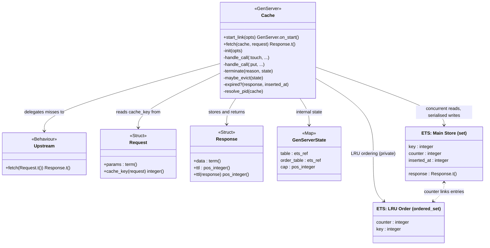
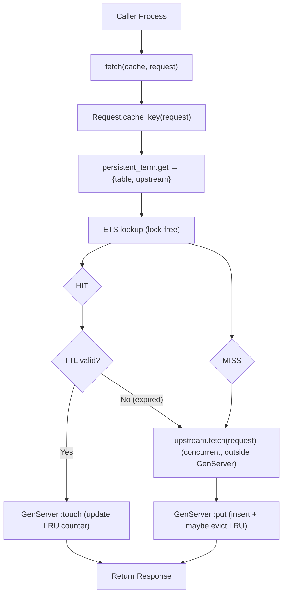
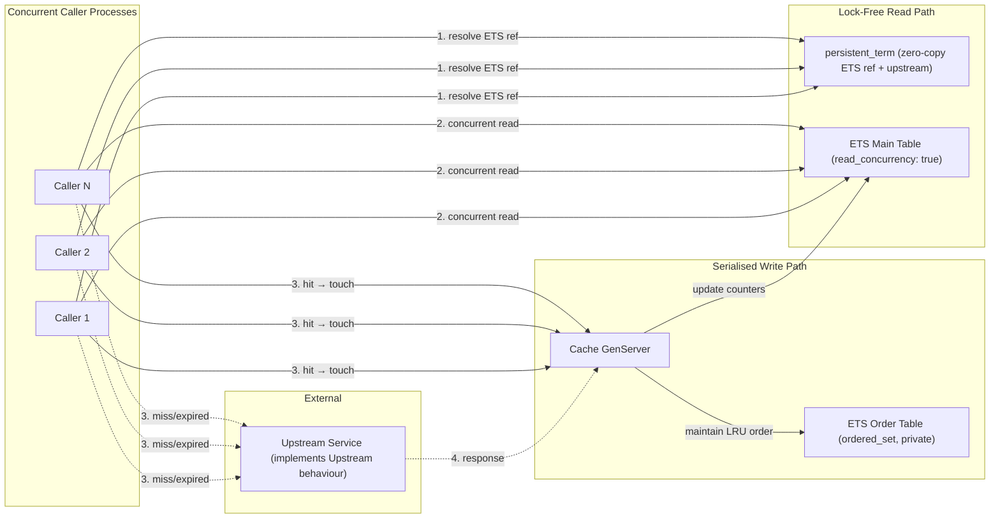

# AppworkTakeHome

## Assumptions when interpreting instructions:
1. "Uses request structs as keys and response structs as values...Same as V1, with the added constraint that the stored entries are distinct request-response tuples." - At the implementation level, the hash is used as the ETS key, and the value is the response
2. "V1 - Basic Cache...It must store responses for at least the last CAP requests" - CAP is treated as maximum capacity and eviction occurs when capacity is exceeded
3. The requirements of V1 anyway imply distinctness ("If a request appears again within the last CAP requests, it should be served from cache and not forwarded upstream.") unless were to make a point of deliberately storing duplicate entries in cache, even after we have verified if they are already in the cache (which also would go against the general requirements that "...The cache must support high concurrency, allowing many concurrent fetch calls..." and "...Uses request structs as keys and response structs as values..."). Given this, then the only difference between V1 and V2 is that V1 is FIFO and V2 is LRU
4. "V2 - LRU Cache" - A cache hit moves the accessed entry to the most-recently-used position, so the entry "within the last CAP distinct requests" window is refreshed on access. This is implemented using two ETS tables: the main store adds a monotonic counter per entry, and a companion `:ordered_set` table sorted by that counter provides O(log n) LRU eviction and O(log n) touch. Cache hits now go through the GenServer (for the touch bookkeeping), but upstream calls and ETS reads remain concurrent - only the lightweight ordering update is serialised
5. "V3 - LRU + TTL Cache...TTL is a positive integer number of seconds." - It seems a bit unusual that the TTL would be stored as whole seconds rather than milliseconds, but to comply with the requirements it will be stored as whole seconds
6.
    "The cache must support high concurrency, allowing many concurrent `fetch/1` calls." - There is a potential issue with the implementation: Thundering Herd (See here for more info: https://en.wikipedia.org/wiki/Thundering_herd_problem and https://en.wikipedia.org/wiki/Cache_stampede). This is when many concurrent callers call fetch/1 at the same time when the cache entry has just expired, leading to each caller triggering the upstream service. (It's as if each "believes" that it is the first to make the call to the upstream.)

    To mitigate this would require either making the Cache GenServer even more of a bottleneck (by having one single GenServer/locking mechanism or a GenServer/locking mechanism for each key/request) and/or tracking in-flight requests and serving the stale response while requests are still busy processing.

    Since we don't know which of a) high concurrency, b) avoiding stale responses or c) not overloading the upstream is more important, it is justifiable for now to keep the implementation simpler and not yet add mitigation for Thundering Herd

## Architecture Diagrams

### Module Diagram

### Data Flow

### Concurrency Design

